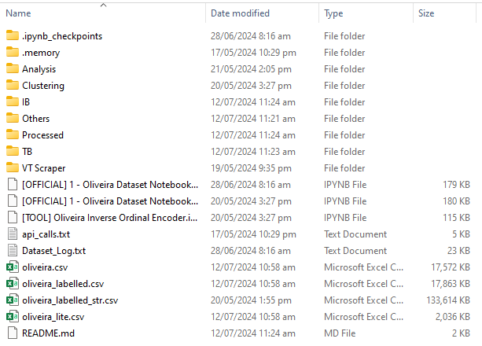
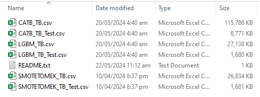
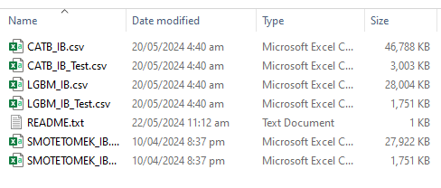
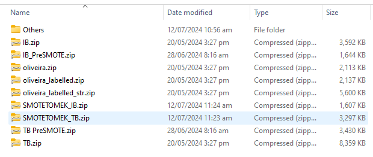

# Dataset

## Pre-requisite Procedure:

### 1. Verify Dataset Existence

**Main (`.\Official Development\Dataset\`)**

**TB (`.\Official Development\Dataset\TB`)**

**IB (`.\Official Development\Dataset\IB`)**

### 2. Unzip Missing Datasets

Should there are missing datasets, kindly look for them under `.\Dataset\Processed` and unzip them to its respective locations. 

#### Reminder: All notebooks that use datasets are filepath dependent.

## Notebooks and Subdirectories

### `[OFFICIAL] 1 - Oliveira Dataset Notebook.ipynb`

This notebook conducts the necessary steps for data pre-processing of the dataset to make it suitable for use in ML model training, tuning, and evaluation. Its outputs will be found in the subdirectories of `IB` and `TB`.

An alternative version of this notebook, `[OFFICIAL] 1 - Oliveira Dataset Notebook Pre_SMOTE.ipynb` was used for the `Model Generalization Test` which requires a non-SMOTEN training dataset.

### 2. Clustering (Malicious & Benign) Notebooks

Found under `.\Dataset\Clustering`, the notebooks conducts data clustering using the source dataset (i.e., ground truth) for use in dataset analysis of the study. The main notebook to focus on is the `[OFFICIAL] DBSCAN_Clustering.ipynb` where its results was used accordingly in study. The results of the clustering was thereafter analyzed using the `.\Dataset\Analysis\[OFFICIAL] 1a ClusterScan All_NoFalse.ipynb`.

### 3. Analysis Notebooks

Found under `.\Dataset\Analysis`, this subsection contains all notebooks used for cluster analysis (via DBSCAN) and dataset analysis (via extended EDA). Particular among these analysis notebooks are notebooks `1a`, `1c`, and `1d`.

### 4. `'Oliveira'` Notebooks

All `oliveira` notebooks are used by other notebooks found in the other sections of this repository. Thus these datasets must be ensured to exist prior to the use of those notebooks.

- `oliveira.csv` - Unmodified raw dataset
- `oliveira_lite.csv` - Unmodified raw dataset (smaller sample size)
- `oliveira_labelled.csv` - Raw dataset with class type labels.
- `oliveira_labelled_str.csv` - Raw dataset with class type labels and inverse label encoded (string API Calls)

### 5. `api_calls.txt`

This file contains the string equivalent of the integer API Calls of the source dataset. It is used during inverse label encoding in the notebooks in this directory and possibly in other notebooks in other directories as well.

### 6. `Dataset_Log.txt`

This log file contains the total time taken to complete the entire runtime for `[OFFICIAL] 1 - Oliveira Dataset Notebook.ipynb`. This is automatically generated and updated everytime the aforementioned notebook is completed.